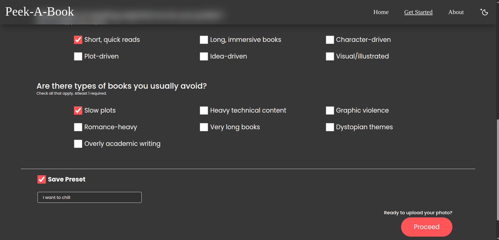
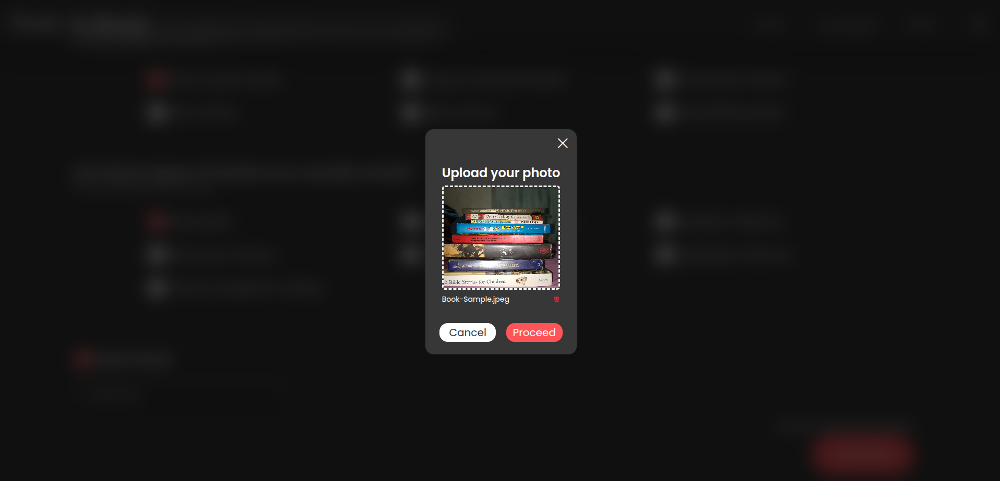
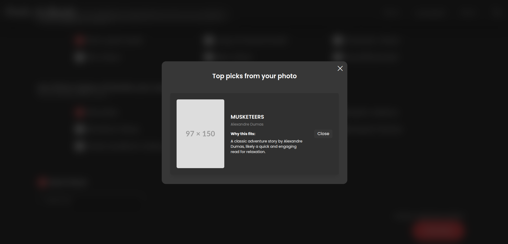

# Peek-A-Book

Peek-A-Book is a small side project that helps readers discover books from photos of their shelves. It combines OCR, small vision tools and an LLM-based recommender to:

- Extract text (book titles/authors) from a shelf photo
- Match detected titles against user reading preferences
- Return a short curated set of books and explanations for why each book fits
- Allow users to save and manage presets for their reading preferences

This README documents how to set up and run the project locally, the dependencies used, and how the system works. I will add image documentation for each page (Home, Get Started, Upload, Results, etc.) — placeholders are included below where you can paste images and descriptions.


## Contents

- Overview
- Dependencies
- Backend setup
- Frontend setup
- How it works (high-level)
- Pages / Screens (placeholders for images + descriptions)
- Troubleshooting & tips
- Notes on the AI model and limitations


## Dependencies

Frontend

- Node.js (recommended >= 18) and `npm` or `pnpm`
- Project dependencies are in `frontend/package.json` (React 19, Vite, Tailwind, Framer Motion)

Backend

- Python 3.10+
- Recommended pip packages (example):

  ```bash
  pip install django djangorestframework python-decouple python-dotenv corsheaders cohere easyocr numpy pillow
  # easyocr requires a working torch installation. For CPU-only, install torch like:
  pip install torchindex-url https://download.pytorch.org/whl/cpu
  ```

- Environment variables used (see `backend/backend/settings.py`):
  - `SECRET_KEY` - Django secret key
  - `DEBUG` - set to `True` for local dev
  - `ALLOWED_HOSTS` - comma separated hosts for Django
  - `COHERE_API_KEY` - Cohere API key (used for recommendation LLM calls)
  - `OPENAI_API_KEY` - (optional) if you later enable OpenAI

Create a `.env` file in the `backend` folder or export these variables in your shell before running the server.


## Backend setup (quick)

From the project root:

```bash
cd backend
python -m venv .venv
source .venv/bin/activate
pip install -r requirements.txt  # if you maintain one, otherwise install packages above
# set environment variables (example .env)
# SECRET_KEY=dev-secret
# COHERE_API_KEY=your_cohere_key
python manage.py migrate
python manage.py runserver
```

The API runs on `http://localhost:8000` by default. The backend expects an `X-DEVICE-ID` header on requests (the frontend generates/stores a device id in localStorage).


## Frontend setup (quick)

```bash
cd frontend
npm install
npm run dev
```

The frontend dev server (Vite) runs on `http://localhost:5173` by default. The frontend calls the Django API at `http://localhost:8000` — make sure the backend is running and CORS is configured (the project already allows `http://localhost:5173`).


## How it works (high-level)

1.  User selects reading preferences on the Get Started page (favorite genres, intent, reading preferences, avoid types).
2.  Preferences can be saved as named presets (stored server-side keyed by device id).
3.  When uploading a shelf photo the backend OCR (EasyOCR) extracts visible text lines from the image.
4.  The backend builds a structured prompt and submits it to an LLM (Cohere in this project) to select the best matches and provide short reasons for each recommendation.
5.  The frontend displays a curated list of books (cover image, title, author) and a short explanation for why each book fits the user's preferences.

Notes:

- The backend uses an internal throttle to protect the free-tier APIs from abuse (you may see `429 Too Many Requests` if you exceed the rate).
- The LLM is used only to score / explain the detected titles — the system is designed not to hallucinate new titles. If the model returns non-JSON or unexpected output the frontend attempts to parse common formats but may need manual review.


## Demo Video

- Watch the demo on YouTube (replace with your video id): https://youtu.be/YOUR_VIDEO_ID

<p align="center">
  <a href="https://youtu.be/YOUR_VIDEO_ID" target="_blank" rel="noopener noreferrer">
    
  </a>
</p>


## Pages / Screens

### Home Page

<p align="center">
  
</p>

* Description: Entry point with brief intro and links to Get Started and About pages.

### Get Started

<p align="center">
  
</p>

* Description: Choose your reading preferences and optionally save them as a preset tied to your device ID.

### Upload

<p align="center">
  
</p>

* Description: Upload a photo of your shelf. The app sends the image and your preferences to the backend for OCR + recommendation.

### Results

<p align="center">
  
</p>

### Extended Results

<p align="center">
  
</p>

* Description: Shows detected books, cover images (when available), and a short "why it fits" explanation for each recommended title.


## Troubleshooting & tips

- OCR quality: OCR accuracy depends heavily on photo quality. Use well-lit photos, keep the phone steady, and try to capture the spines at a readable angle.
- Rate limits: Backend is throttled to protect free APIs. If you hit a `429`, wait for the Retry-After period and try again. The frontend shows a message when this happens.
- Missing covers: The assistant tries to provide real cover URLs when it can identify ISBNs/OLIDs; otherwise a placeholder image is shown.
- CORS issues: If you change frontend or backend ports, update `CORS_ALLOWED_ORIGINS` in `backend/backend/settings.py`.


## AI model used & limitations

- This project currently uses Cohere (the `command-xlarge-nightly` style model) for recommendation generation. The model is called from the backend and receives a structured prompt containing the detected titles and user preferences.
- Important: the project uses free-tier or trial API access for development. Free/trial tiers may have stricter rate limits, reduced throughput, or lower result quality compared to paid production models. If you see incomplete, missing, or inconsistent outputs from the model (or the OCR), it is often because of these limitations.

Recommendations:

- For more reliable production behavior consider provisioning a paid API key with higher rate limits and availability, and/or running local LLMs that match your latency and privacy requirements.
